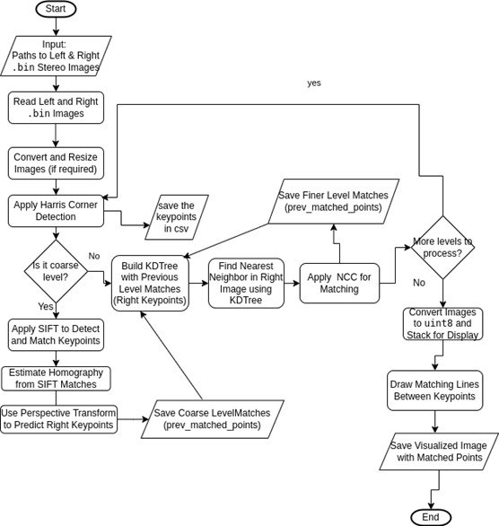
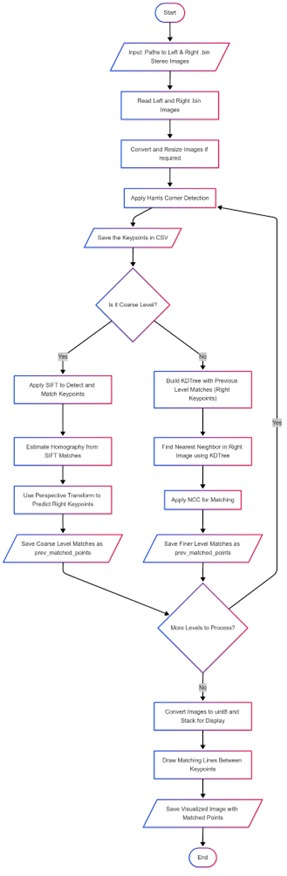
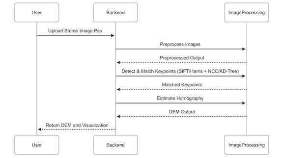

# Hierarchical Image Matching for DEM Generation using Stereo Imagery

🚀 **Internship Project under SRTD-VYOM at Space Applications Centre (SAC), ISRO**  
📅 **Duration**: January 20, 2024 – April 17, 2024  
👩‍💻 **Intern**: Aeni N. Parmar  
🏫 **College**: Government Engineering College, Bhavnagar   

---

## 📌 Project Overview

This project focuses on the generation of **Digital Elevation Models (DEMs)** using stereo satellite imagery through a **hierarchical image matching approach**. The aim was to improve matching accuracy and computational efficiency by leveraging multi-resolution analysis and refined feature matching techniques.

---

## 🎯 Objective

- Develop a hierarchical image matching pipeline for high-resolution stereo satellite images.
- Generate accurate DEMs through coarse-to-fine feature matching and refinement.
- Automate key steps including preprocessing, matching, alignment, and output generation.

---

## 🛠️ Tools & Technologies

- **Languages**: Python
- **Libraries**: OpenCV, GDAL, SciPy, NumPy, Matplotlib
- **Algorithms**: Harris Corner Detection, SIFT, RANSAC, KDTree, Normalized Cross-Correlation (NCC)
- **Environment**: Linux, PyCharm

---

## ⚙️ Methodology

1. **Image Preprocessing**: Resize, convert, and clean satellite imagery.
2. **Image Pyramid Generation**: Build multi-level image representations.
3. **Feature Detection**: Detect keypoints using Harris and SIFT.
4. **Coarse Matching**: Use SIFT and RANSAC at the highest level.
5. **Refined Matching**: KDTree + NCC to verify correspondences at finer levels.
6. **DEM Generation**: Align and store matched keypoints, disparity map computation.

---

## 📊 Project Diagrams

### 🔁 Workflow Diagram

### 🧩 Activity Diagram

### 🔄 Sequence Diagram

---

## ✅ Outcomes

- Successfully built a prototype for hierarchical image matching and DEM generation.
- Achieved more accurate terrain mapping using multi-level processing and refinement.
- Enhanced understanding of stereo satellite image processing techniques.

---

## 🔒 Confidentiality Notice

Due to ISRO security and data protection policies, **source code, datasets, and internal tools used in this project are not publicly available**. This repository only documents the high-level methodology and outcomes.

---

## 📎 Additional Resources

- 📄 [Internship Documentation (PDF)](docs/Aeni_Internship_Summary.pdf)

---

## 💡 Key Learnings

- Practical experience with satellite image processing
- Real-world application of feature detection and matching algorithms
- Experience in working under a space research organization's standards

---

Thank you for visiting this project summary. For any further discussion, feel free to connect!
